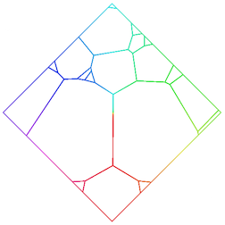
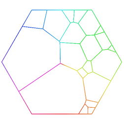
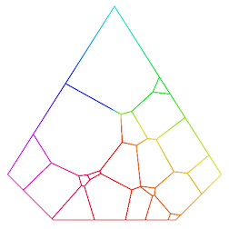
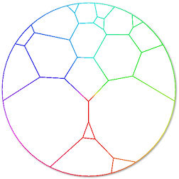
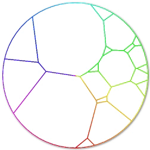

# voronoi-map-mcp-server

This MCP server produces a _Voronoï map_ (i.e. one-level treemap). Given a convex polygon and weighted data, it tesselates/partitions the polygon in several inner cells, such that the area of a cell represents the weight of the underlying datum.

Because a picture is worth a thousand words:







## Context

This MCP server encapsulates the [d3-voronoi-map](https://github.com/Kcnarf/d3-voronoi-map) package, making it accessible to LLMs.

This MCP server allows to compute a map with a unique look-and-feel, where inner areas are not strictly aligned each others, and where the outer shape can be any hole-free convex polygons (square, rectangle, pentagon, hexagon, ... any regular convex polygon, and also any non regular hole-free convex polygon).

The computation of the Voronoï map is based on a iteration/looping process, until stabilization. Hence, obtaining the final partition requires _some iterations_/_some times_, depending on the number and type of data/weights, the desired representativeness of cell areas.

You can go to the [d3-voronoi-map](https://github.com/Kcnarf/d3-voronoi-map) repository for more details, some real life use cases, and more.

## Installation

### Prerequisites

- **Node.js** 18+ and yarn (to run the server locally)
- **Claude Desktop** (to integrate the MCP server)

### Setup Steps

1. **Clone the repository**
   ```bash
   git clone https://github.com/Kcnarf/voronoi-map-mcp-server.git
   cd voronoi-map-mcp-server
   ```

2. **Install dependencies**
   ```bash
   yarn install
   ```
   This installs the MCP SDK and the d3-voronoi-map library.

3. **Configure in Claude Desktop**

   Edit `~/Library/Application Support/Claude/claude_desktop_config.json` (macOS) or the equivalent on your OS, and add:

   ```json
   {
     "mcpServers": {
       "voronoi-map": {
         "command": "node",
         "args": ["/absolute/path/to/voronoi-map-mcp-server/src/index.js"]
       }
     }
   }
   ```

   Replace `/absolute/path/to/voronoi-map-mcp-server` with the actual path where you cloned the repository.

4. **Restart Claude Desktop** to load the new MCP server.

5. **Verify** — The `compute_voronoi_map` tool should now be available in Claude. You can test it by asking Claude to compute a Voronoi map.

## Usage
**step 1**: the LLM sends two pieces of information:
* the outer shape,
* an array of data which will partition the outer shape.

The pieces of informations sent by the LLM should be formated as a JSON object:
```json
{
    shape: [[x0,y0], [x1,y1], ...],  // array of 2D verteces defining the convex, hole-free, outer shape to tesselate
    data: [                 // array of data that will be mapped to cells
        {
            id: "data0",    // an unique identifier
            weight: 10,     // the importance/weight of the data
            ...             // other valuable pieces of information later used by the LLM in its agentic workflow, such as the color of the cell related to the data
        },
        {
            id: "data1",
            weight: 20,
            ...
        }
        ...
    ]
}
```
**Step 2**: the MCP server computes the tesselation and responds with a JSON-formated array of cells/polygons:
```json
[
    {
        polygon: [x'0,y'0], [x'1, y'1], ...],   // array of verteces of the cell
        datum: {id : "data0", weight: 10, ...}  // the underlying data the cell is representing;
    },
    {
        polygon: [x''0,y''0], [x''1, y''1], ...],
        datum: {id : "data1", weight: 20, ...}
    },
    ...
]
```

**Step 3**: the LLM computes and displays the SVG based on the returned tesselation.

The SVG rendering is intentionnaly left to the LLM which can handle rendering options, such as cell colors, cell strokes, resizing, ... later in its agentic workflow.

## Reference

- based on [Computing Voronoï Treemaps - Faster, Simpler, and Resolution-independent ](https://www.uni-konstanz.de/mmsp/pubsys/publishedFiles/NoBr12a.pdf)
- [https://github.com/ArlindNocaj/power-voronoi-diagram](https://github.com/ArlindNocaj/power-voronoi-diagram) for a Java implementation