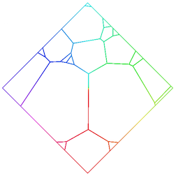
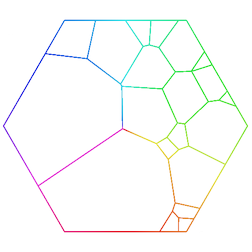
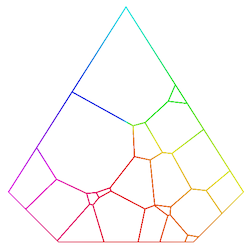
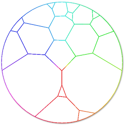
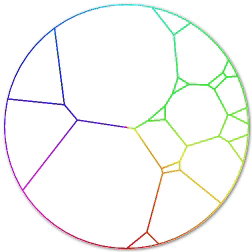

# voronoi-map-mcp-server

This MCP server produces a _Voronoï map_ (i.e. one-level treemap). Given a convex polygon and weighted data, it tesselates/partitions the polygon in several inner cells, such that the area of a cell represents the weight of the underlying datum.

Because a picture is worth a thousand words:







Note : all the examples above use the same data set, only the countour shape differs.

## Context

This MCP server encapsulates the [d3-voronoi-map](https://github.com/Kcnarf/d3-voronoi-map) package, making it accessible to LLMs.

This MCP server allows to compute a map with a unique look-and-feel, where inner areas are not strictly aligned each others, and where the outer shape can be any hole-free convex polygons (square, rectangle, pentagon, hexagon, ... any regular convex polygon, and also any non regular hole-free convex polygon).

The computation of the Voronoï map is based on a iteration/looping process, until stabilization (cf. the animation of the fifth example above). Hence, obtaining the final partition requires _some iterations_/_some times_, depending on the number and type of data/weights, the desired representativeness of cell areas.

You can go to the [d3-voronoi-map](https://github.com/Kcnarf/d3-voronoi-map) repository for more details, some real life use cases, and more.

## Quick Start

Once installed, copy-paste this into Claude Desktop to see it in action:

**Prompt:**
```
Use the voronoi-map-mcp-server to compute a Voronoï map for a square shape [[0,0], [100,0], [100,100], [0,100]] with three items:
- Item A: weight 30
- Item B: weight 50  
- Item C: weight 20

Then render the resulting cells as an SVG visualization.
```

Claude will invoke the `compute_voronoi_map` tool and compute a tesselation where each cell's area represents its weight, then create an SVG visualization. The result should look similar to the examples at the top of this README.

## Practical Examples

The power of the voronoi-map-mcp-server lies in an AI agent's ability to compute the visualization **and** provide intelligent narrative analysis. Any AI agent (Claude, or other LLMs) can use this tool.

### Example 1: Budget Allocation Analysis

**Prompt to the AI agent:**
```
Show me the projected distribution of the year's budget across our 5 departments:
- Sales: $2.5M
- Engineering: $3.8M
- Marketing: $1.2M
- Operations: $1.0M
- HR: $0.5M

Create a Voronoi map visualization and analyze the allocation strategy. 
Highlight any imbalances or concerns.
```

**What the AI agent does:**
1. Calls `compute_voronoi_map` with the budget figures as weights
2. Renders the tesselation as SVG (each cell's area represents the budget proportion)
3. Analyzes the allocation: "Engineering receives 40% of the budget, which is appropriate for a tech-focused company. However, Marketing at 12% may be under-resourced compared to industry benchmarks. Consider whether Sales and Engineering are correctly balanced..."

### Example 2: Workload Distribution Analysis (Multi-Step)

**Step 1 — Load the data:**
```
Fetch the current sprint task assignments from our project management system. 
For each engineering team (Frontend, Backend, DevOps, QA), 
retrieve the total estimated effort hours for tasks in progress.
```

**Step 2 — Analyze and visualize:**
```
Using the effort data retrieved from step 1, create a Voronoi map visualization 
that shows the relative workload distribution across teams. 
Identify potential bottlenecks or capacity issues.
```

**What the AI agent does:**
1. Calls the project management tool/API to retrieve current workload data
2. Calls `compute_voronoi_map` with the effort hours as weights (e.g., Frontend: 240h, Backend: 380h, DevOps: 95h, QA: 185h)
3. Renders the tesselation as SVG (each cell shows the team's relative workload)
4. Provides strategic insights: "Backend is carrying 39% of the total load, which is expected for a services-heavy product. However, DevOps (10%) appears severely under-resourced relative to infrastructure complexity. QA at 19% could be stretched thin during release cycles..."

These examples show how the MCP server goes beyond visualization—the AI agent combines the Voronoi map with data retrieval, analysis, business insights, and actionable recommendations.

## Best Practices

### Number of Parts

While Voronoi maps work well for smaller distributions (5-10 parts), visualization effectiveness decreases beyond 10-20 parts, similar to pie charts. As the number of cells increases, individual cells become harder to distinguish, and the visual loses clarity.

**Recommendations:**
- **5-10 parts:** Ideal range for clear, readable visualizations
- **10-20 parts:** Still acceptable, but approaching the upper limit
- **20+ parts:** Consider grouping less significant parts into an "Others" category to reduce visual complexity while preserving the overall structure

Example: Instead of showing 25 product SKUs individually, group low-revenue items into "Other Products" (weighted by their combined revenue), resulting in 5-10 meaningful cells plus the "Other" cell.

## API Reference

The `compute_voronoi_map` tool accepts a shape (convex polygon) and weighted data, then computes a Voronoï tesselation where each cell's area is proportional to its corresponding weight.

### Parameter Reference

#### Required Parameters

- **`data`** — Array of data objects to partition. Each must have `id` (unique string) and `weight` (positive number). Additional properties are preserved in the output.

#### Optional Parameters

- **`shape`** — Array of [x, y] coordinates defining the convex polygon boundary (default: unit square [[0,0], [1,0], [1,1], [0,1]]).
- **`maxIterationCount`** — Maximum iterations before stopping (default: 50). Higher values produce more precise results.
- **`convergenceRatio`** — Precision threshold for convergence (default: 0.01). Smaller values are more accurate but slower.
- **`minWeightRatio`** — Minimum weight ratio floor (default: 0.01). Prevents very small weights from causing instability.
- **`seed`** — String seed for reproducible, deterministic results across runs.

For complete parameter documentation, types, detailed descriptions, and examples, see the [tool definition in `./src/server.js`](./src/server.js).

### Data Format & Workflow

The tool operates in three steps:

**Step 1**: Input data is formatted as a JSON object:
```json
{
    "shape": [[0,0], [100,0], [100,100], [0,100]],
    "data": [
        { "id": "data0", "weight": 10 },
        { "id": "data1", "weight": 20 }
    ]
}
```

**Step 2**: The MCP server returns an array of tessellated cells:
```json
[
    {
        polygon: [[x'0, y'0], [x'1, y'1], ...],
        datum: { id: "data0", weight: 10, ... }
    },
    {
        polygon: [[x''0, y''0], [x''1, y''1], ...],
        datum: { id: "data1", weight: 20, ... }
    }
]
```

**Step 3**: The calling agent computes and displays the SVG based on the tessellation.

The SVG rendering is intentionally left to the agent, which can handle rendering options such as cell colors, strokes, and resizing.

## Installation

### Prerequisites

- **Node.js** 18+ and yarn (to run the server locally)
- **Claude Desktop** (to integrate the MCP server)

### Setup Steps

1. **Clone the repository**
   ```bash
   git clone https://github.com/Kcnarf/voronoi-map-mcp-server.git
   cd voronoi-map-mcp-server
   ```

2. **Install dependencies**
   ```bash
   yarn install
   ```
   This installs the MCP SDK and the d3-voronoi-map library.

3. **Configure in Claude Desktop**

   Edit the Claude configuration file and add the server configuration. The location depends on your OS (paths are current as of 2026-06-02; the AI ecosystem changes rapidly, so verify against [Claude's official docs](https://modelcontextprotocol.io) if these paths have changed):

   - **macOS**: `~/Library/Application Support/Claude/claude_desktop_config.json`
   - **Windows**: `%APPDATA%\Claude\claude_desktop_config.json`
   - **Linux**: `~/.config/Claude/claude_desktop_config.json`

   Add this to your config:

   ```json
   {
     "mcpServers": {
       "voronoi-map": {
         "command": "node",
         "args": ["/absolute/path/to/voronoi-map-mcp-server/src/index.js"]
       }
     }
   }
   ```

   Replace `/absolute/path/to/voronoi-map-mcp-server` with the actual path where you cloned the repository.

4. **Restart Claude Desktop** to load the new MCP server.

5. **Verify** — The `compute_voronoi_map` tool should now be available in Claude. You can test it by asking Claude to compute a Voronoi map.

## Testing

```bash
yarn test
```

The test suite covers computation logic, parameter handling, and error formatting.

## Reference

- based on [Computing Voronoï Treemaps - Faster, Simpler, and Resolution-independent ](https://www.uni-konstanz.de/mmsp/pubsys/publishedFiles/NoBr12a.pdf)
- [https://github.com/ArlindNocaj/power-voronoi-diagram](https://github.com/ArlindNocaj/power-voronoi-diagram) for a Java implementation